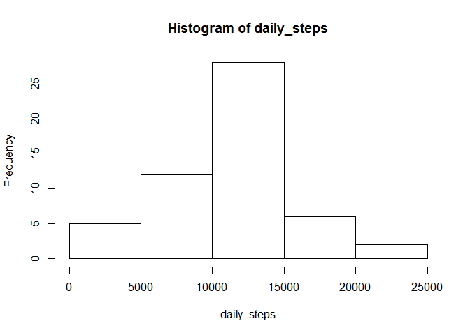
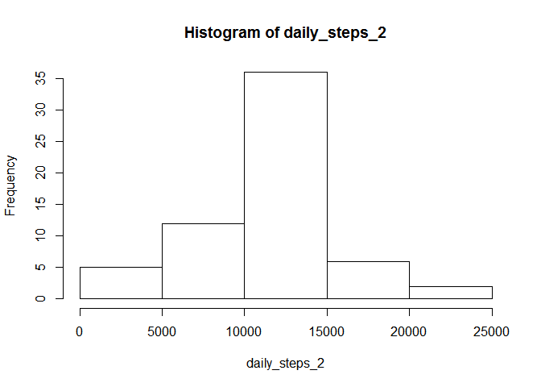
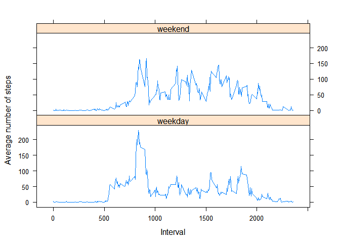

# Reproducible Research Assignment 1
Allison Silcox  
Monday, September 14, 2015  

**Introduction**    

It is now possible to collect a large amount of data about personal movement using activity monitoring devices such as a Fitbit, Nike Fuelband, or Jawbone Up. These type of devices are part of the "quantified self" movement - a group of enthusiasts who take measurements about themselves regularly to improve their health, to find patterns in their behavior, or because they are tech geeks. But these data remain under-utilized both because the raw data are hard to obtain and there is a lack of statistical methods and software for processing and interpreting the data.    

This assignment makes use of data from a personal activity monitoring device. This device collects data at 5 minute intervals through out the day. The data consists of two months of data from an anonymous individual collected during the months of October and November, 2012 and include the number of steps taken in 5 minute intervals each day.    

**Data**    

The variables included in this dataset are:  

-steps: Number of steps taking in a 5-minute interval (missing values are coded as NA)  
-date: The date on which the measurement was taken in YYYY-MM-DD format  
-interval: Identifier for the 5-minute interval in which measurement was taken    


**Loading and preprocessing the data**

Show any code that is needed to:  
1. Load the data (i.e. read.csv())  
2. Process/transform the data (if necessary) into a format suitable for your analysis


```r
activity=read.csv("activity.csv")
```

**What is mean total number of steps taken per day?**  

For this part of the assignment, you can ignore the missing values in the dataset.  

1. Calculate the total number of steps taken per day  


```r
daily_steps=tapply(activity$steps, activity$date, sum)
```

2. Make a histogram of the total number of steps taken each day  


```r
hist(daily_steps)
```

 

3. Calculate and report the mean and median of the total number of steps taken per day  


```r
mean(daily_steps,na.rm=TRUE)
```

```
## [1] 10766.19
```

```r
median(daily_steps,na.rm=TRUE)
```

```
## [1] 10765
```

**What is the average daily activity pattern?**

1. Make a time series plot (i.e. type = "l") of the 5-minute interval (x-axis) and the average number of steps taken, averaged across all days (y-axis)  


```r
interval_avg=tapply(activity$steps,activity$interval,mean,na.rm=TRUE)
plot(names(interval_avg),interval_avg,type="l",xlab="Interval",ylab="Average number of steps")
```

 

2. Which 5-minute interval, on average across all the days in the dataset, contains the maximum number of steps?


```r
names(sort(interval_avg,decreasing=TRUE)[1])
```

```
## [1] "835"
```

**Imputing missing values**

Note that there are a number of days/intervals where there are missing values (coded as NA). The presence of missing days may introduce bias into some calculations or summaries of the data.

1. Calculate and report the total number of missing values in the dataset (i.e. the total number of rows with NAs)  


```r
activity$missing=(is.na(activity$steps))
table(activity$missing)
```

```
## 
## FALSE  TRUE 
## 15264  2304
```

2. Devise a strategy for filling in all of the missing values in the dataset. The strategy does not need to be sophisticated. For example, you could use the mean/median for that day, or the mean for that 5-minute interval, etc.  
3. Create a new dataset that is equal to the original dataset but with the missing data filled in.  


```r
interval_avg_df=data.frame(interval_avg)
## Use the interval average for missing values
activity_2=merge(activity,interval_avg_df,by.x="interval", by.y="row.names")
activity_2$steps2=ifelse(activity_2$missing,activity_2$interval_avg,activity_2$steps)
```

4. Make a histogram of the total number of steps taken each day and Calculate and report the mean and median total number of steps taken per day. Do these values differ from the estimates from the first part of the assignment? What is the impact of imputing missing data on the estimates of the total daily number of steps?


```r
daily_steps_2=tapply(activity_2$steps2, activity_2$date, sum)
hist(daily_steps_2)
```

 

```r
mean(daily_steps_2,na.rm=TRUE)
```

```
## [1] 10766.19
```

```r
median(daily_steps_2,na.rm=TRUE)
```

```
## [1] 10766.19
```

*There is virtually no difference/no impact on the mean/median when using the mean to fill in missing values - only a marginal change to the median.*  


**Are there differences in activity patterns between weekdays and weekends?**  

For this part the weekdays() function may be of some help here. Use the dataset with the filled-in missing values for this part.  

1. Create a new factor variable in the dataset with two levels - "weekday" and "weekend" indicating whether a given date is a weekday or weekend day.  


```r
activity_2$weekday=weekdays(as.POSIXct(activity_2$date))
activity_2$weekdays=ifelse(ifelse(activity_2$weekday %in% c("Sunday","Saturday"),0,1),"weekday","weekend")
```

2. Make a panel plot containing a time series plot (i.e. type = "l") of the 5-minute interval (x-axis) and the average number of steps taken, averaged across all weekday days or weekend days (y-axis). See the README file in the GitHub repository to see an example of what this plot should look like using simulated data.


```r
interval_avg_2=aggregate(activity_2[6],data.frame(activity_2[1],activity_2[8]),mean)
interval_avg_2df=data.frame(interval_avg_2)
interval_avg_2df$weekdays=as.factor(interval_avg_2df$weekdays)
library(lattice)
xyplot(steps2~interval|weekdays,data=interval_avg_2df,type='l',layout=c(1,2),xlab="Interval",ylab="Average number of steps")
```

 

*Weekdays show a lot of steps concentrated early in the day (>200) around interval 835 = 8:35am (presumably around the start of work) and then fall dramatically into a relatively low, stable pattern (~50 during waking hours).  Weekends, on the other hand, have a lower, more drawn out morning peak (~150) around 8:30-9am and remain a bit below the peak level (~100) most of the day - i.e. steps are more consistent (and higher) throughout the day on weekends*  
